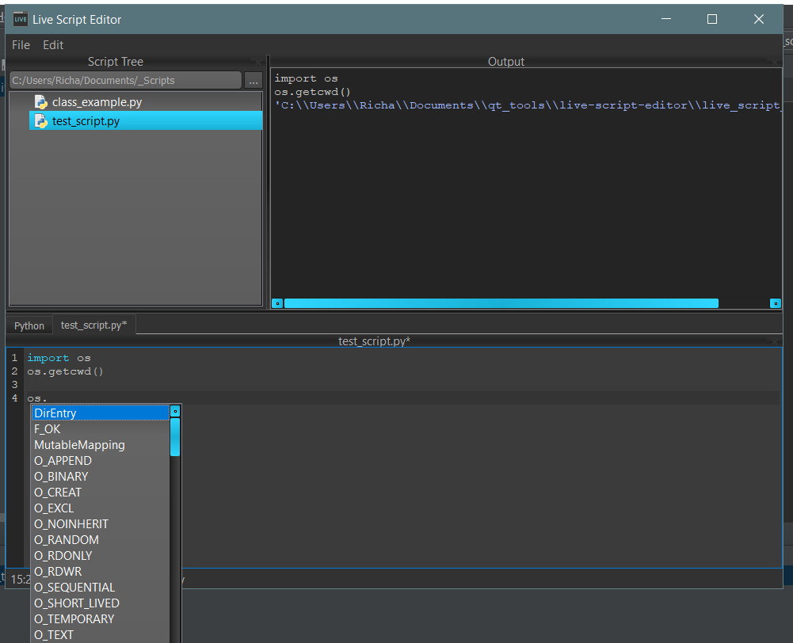

# live-script-editor
Maya-like Python script editor

I like how the Maya script editor lets you hold on to instances. So this is an attempt to make a DCC generic version that can be used standalone and in MotionBuilder.

# Install
<pre>

pip install git+https://github.com/rBrenick/live-script-editor

# Has dependency on PySide2 and Qt.py
</pre>

# Run
<pre>

-------------------------------------------------------
# from command line:

livescripter (with optional .py file argument as script to open)

-------------------------------------------------------

# from DCC:
import live_script_editor
live_script_editor.main()

</pre>
